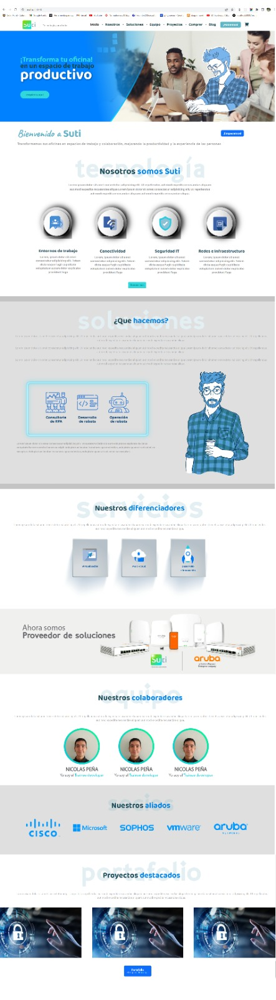

# Reporte 21.04.23

## 1. Resumen del día

> Creación y maquetación del componente **About** de la app.

> Creación y maquetación del componente **Services** de la app.

> Creación y maquetación del componente **Team** de la app.

> Creación y maquetación del componente **Partners** de la app.

> Creación y maquetación del componente **Portfolio** de la app.

## 2. Progreso de aprendizaje

> Creación de una "profile picture" según el diseño del mockup el cual requiere un borde que contenga un gradiente con un direccionamiento de 45°; desarrollo a traves de pseudo-elementos de css.

```css
&--item {
  display: flex;
  justify-content: center;
  align-items: center;
  width: 200px;
  height: 200px;
  border-radius: 50%;
  position: relative;

  &::before {
    content: "";
    position: absolute;
    top: -10px;
    left: -10px;
    right: -10px;
    bottom: -10px;
    z-index: -1;
    border-radius: inherit;
    background-image: linear-gradient(45deg, #07c4e0, #04f991);
  }

  img {
    object-fit: cover;
    height: 100%;
    width: 100%;
    width: 200px;
    height: 200px;
    border-radius: 50%;
  }
}
```

## 3. Dificultades encontradas

> Sin dificultades para reportar.

## 4. Preguntas y/o comentarios

> Por el momento todo en orden, si dudas o inquietudes.

## 5. Plan del día siguiente

> Establecer el maquetado de la siguiente sección corresóndiente al "Footer".

> Iniciar con la refactorización del código aplicado a bootstrap y typeScript.

> Documentar cada etapa de refactorización.

> Apoyarme en documentación y recursos extras para resolver dudas ( documentación - ChatGPT).

## 6. Imagenes del desarrollo


