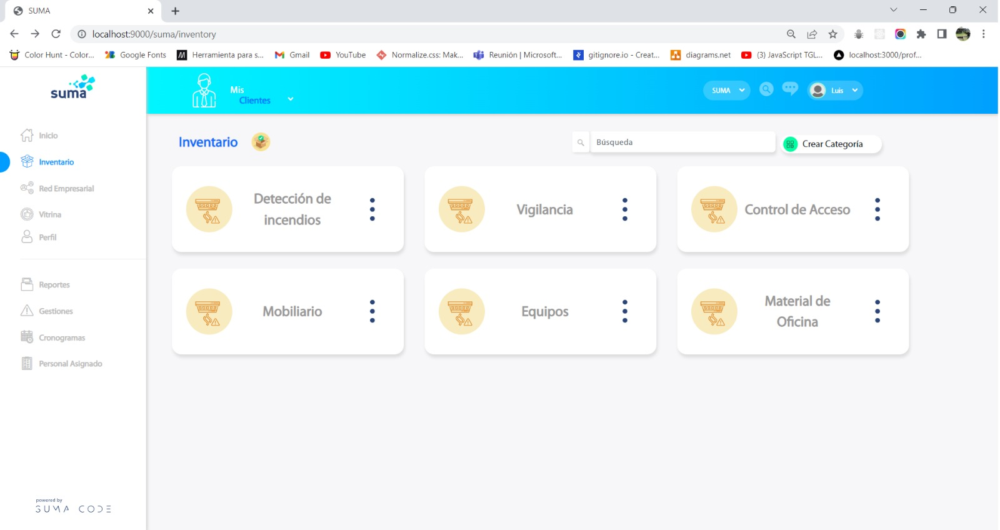
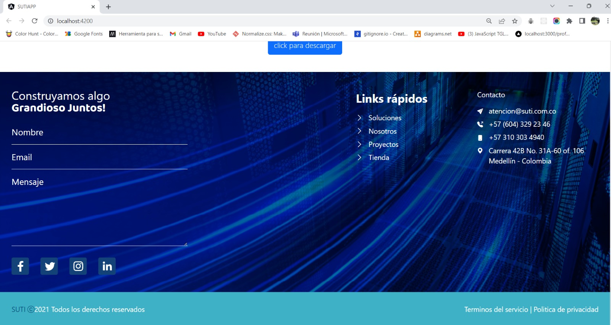
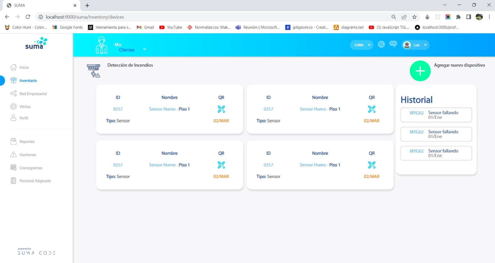

# Reporte 25.04.23

## 1. Resumen del día

> Creacion y desarrollo del componente footer de la landing page de SUTI.

> Creación de documentación para el proyecto MF.SUMA.Inventory.

> Refactorizacion y adicion de estilos a los componentes cards de MF.SUMA.Inventory.

## 2. Progreso de aprendizaje

> Manejo de distintos ambientes a traves de archivos enviroment.ts

> Enrutamiento a través de modulos.

> Configuración de App.Module

## 3. Dificultades encontradas

> Sin dificultades para reportar.

## 4. Preguntas y/o comentarios

> Sin dudas o comentarios para reportar.

## 5. Plan del día siguiente

> Dar continuidad a la interfaz de SUTI.

> Optimizar el UI de la landing page de SUTI.

## 6. Imagenes del desarrollo

